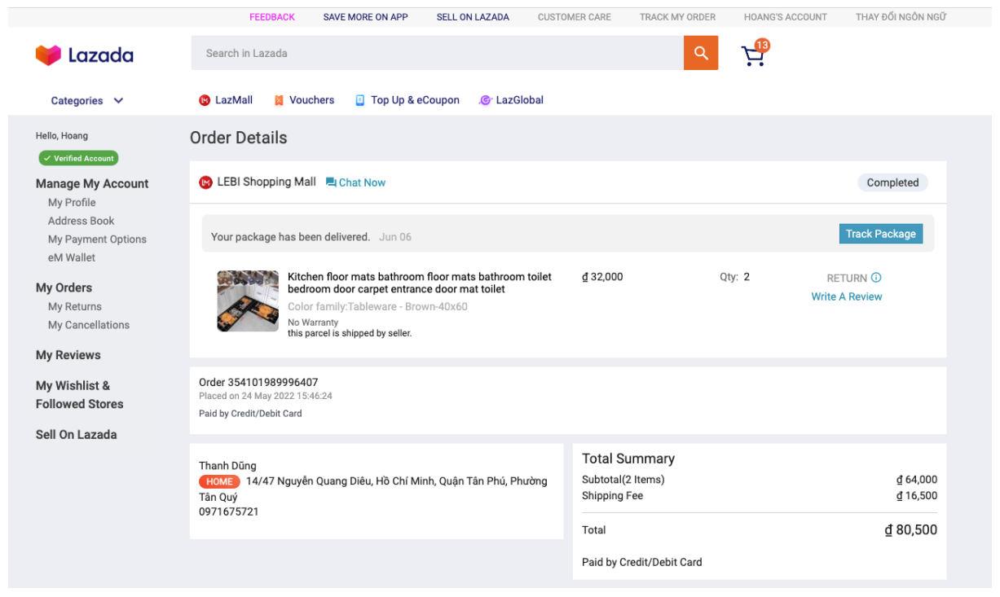
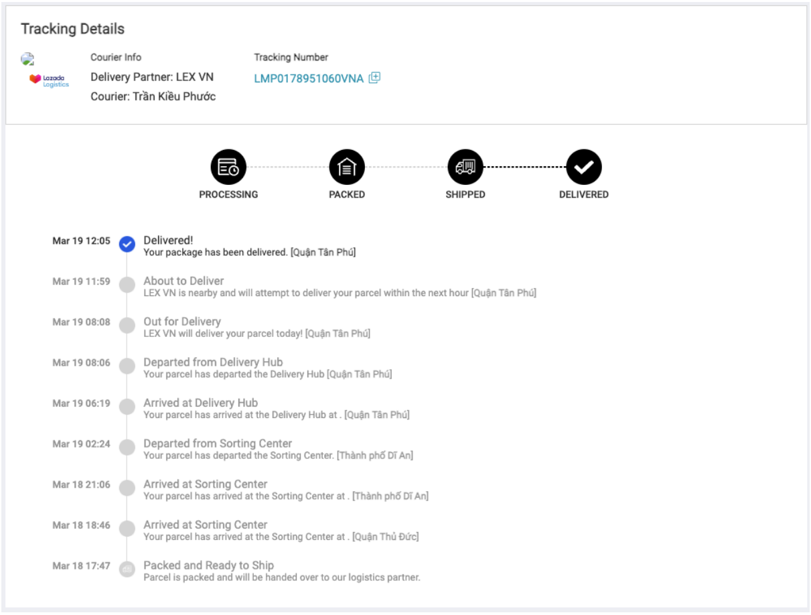

From the time an order is confirmed, the logistics system is fully responsible for ensuring the parcel reaches the designated destination in time.
Below is the web-based UI for buyers to track the order details, including the tracking information.

From a user perspective, they can keep track of the parcel movement using Tracking Details page, which shows the details of courier information, latest position and the status of the parcel, 
which has four main steps (order processing, parcel packed, parcel shipped, and parcel delivered).

Responsible for core logistics data flow, I owned the parcel state machine (the status list, their possible transitions with conditions) and ensured it was accurately configured across all logistics modules. 
Moreover, I participated in different projects (e.g. last mile optimisation, sortation process enhancement, recruitment automation) with the goals to improve customer experience, enhance logistics operation performance, digitalise offline processes, and enable new logistics capabilities.